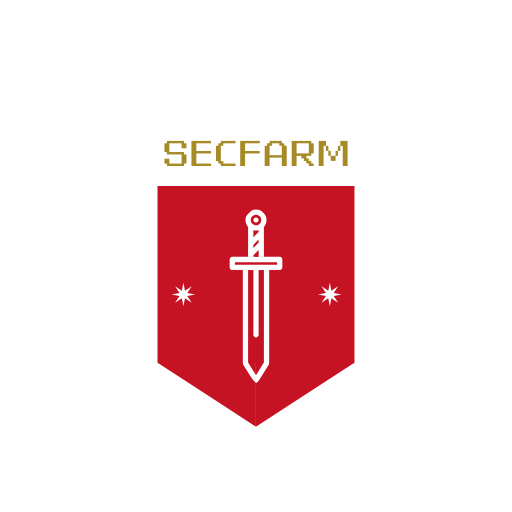

# Secfarm
CLI based LLM agent for security alert analysis.

  

This is:
- Minimal implementation of [Warren](https://github.com/secmon-lab/warren).
- Reference implementation of [Advent Calender 2025 by gaebalai](https://github.com/gaebalai/advcal2025)
